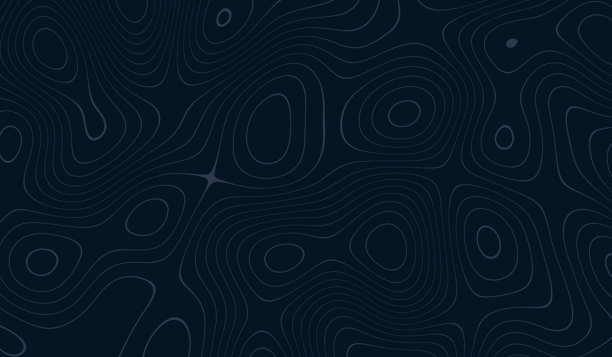

# Topological Renderer

A custom WebGL implementation that renders an animated topological pattern based on perlin noise.
Makes for a very soothing background for your website.

Currently not distributed as a package.